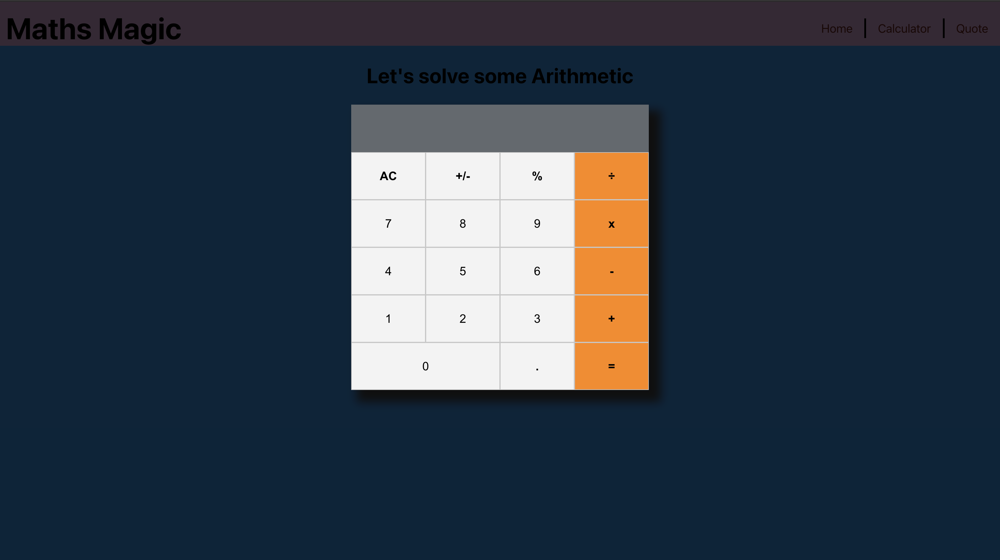

# Math Magicians - React Project

> The "Math magicians" is a website for all fans of mathematics. It is a Single Page App (SPA) that allows users to:

* Make simple calculations.
* Read a random math-related quote. By building this application, you will learn how to use React.

This project's goal is to teach and make sure that we know how to create an App with React and use/understand the concept of Single Page Apps.[Find project specifications here](https://github.com/microverseinc/curriculum-react-redux/blob/main/math-magicians/sneak_peek.md)
      

<div align="center">

[](https://github.com/errea/maths-magician-react)
[](https://github.com/errea/maths-magician-react/issues)
[](https://github.com/errea/maths-magician-react/pull/2)

</div>

## 📝 Contents

<p align="center">
<a href="#with">Built with</a>&nbsp;&nbsp;&nbsp;|&nbsp;&nbsp;&nbsp;
<a href="#gs">Getting started</a>&nbsp;&nbsp;&nbsp;|&nbsp;&nbsp;&nbsp;
<a href="#author">Author</a>
</p>

># [Description]
>In this project, you will create a full website for the Math magicians app, consisting of several pages and using the components you already created.


## 🔧 Built with<a name = "with"></a>

- JavaScript
- React
- NPM
- Functional based Components with React Hooks 
- Virtual DOM
- [Webpack config](hhttps://webpack.js.org/guides/getting-started/)
- ES6 Modules 
- [Gitflow](https://github.com/microverseinc/curriculum-transversal-skills/blob/main/git-github/articles/gitflow.md)
- Use [React Router](https://reactrouter.com/).
- Use styles in a React app. [CSS modules](https://github.com/css-modules/css-modules).

  


## Getting Started <a name = "gs"></a>
> To get a local copy up and running follow these simple example steps.

<details>
  <summary>Get instructions</summary>

```
$ cd <folder>
```

~~~bash
$ git clone https://github.com/errea/maths-magician-react.git
$ cd maths-magician-react folder
~~~

Run `yarn Install` to install the node modules and webpacker.

Run `yarn build` to build the bundler.

Run `yarn start`  opens on `http://localhost:8080/` in your browser.

## Set up
* Open your terminal and locate the folder you want to clone the repository and follow the steps above to install

</details>

## Project Structure

    maths-magician-react
    └── node_modules
    └── .github\workflows
        └── linters.yml
    └── src
        └── /img
      └── index.html
      └── index.js   
      └── components
      └── componentsStyles 
      └── style.css
    └── .eslintrc.json
    └── .gitignore
    └── .hintrc
    └──.stylelintrc.json
    └── MIT.md
    └── package-lock.json
    └── package.json
    └──README.md

## ✒️  Authors <a name = "author"></a>

👤 **Eri**

- Github: [@errea](https://github.com/errea)
- Twitter: [@Erreakay](https://github.com/errea)
- Linkedin: [Eri Okereafor](https://www.linkedin.com/in/eri-ngozi-okereafor/)
  
## 🤝 Contributing

Contributions, issues and feature requests are welcome!

Feel free to check the [issues page](https://github.com/errea/maths-magician-react/issues)
## 👍 Show your support

- Microverse: [@microverse](https://www.microverse.org/)

## Acknowledgments

- Microverse

## 📝 License

This project is [MIT](./MIT.md) licensed.

